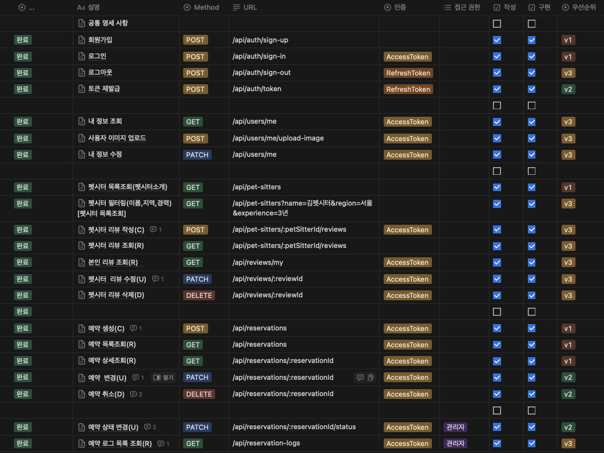

# 타입스크립트 기반으로 펫시터 매칭 서비스

# 실행 방법.

- JavaScript 컴파일

```sh
npm run build #프로젝트의 build 스크립트를 실행
npx tsc   # TypeScript 컴파일러를 사용하여 .ts 파일을 .js 파일로 변환
```

- 서버 실행(개발용)

```sh
npm run start
```

```
## npm run build

이 명령어는 `package.json` 파일에 정의된 build 스크립트를 실행합니다.
build 스크립트는 일반적으로 TypeScript 컴파일뿐만 아니라 다른 작업(예: 번들링, 미니파이, 테스트 실행 등)을 포함할 수 있습니다.
즉, 프로젝트에 따라 다양한 작업을 함께 수행할 수 있습니다.

## npx tsc

이 명령어는 TypeScript 컴파일러(`tsc`)를 직접 실행합니다.
`tsc`는 TypeScript 파일을 JavaScript로 변환하는 전용 도구입니다.
이 명령어는 `tsconfig.json` 파일을 참조하여 TypeScript 컴파일을 수행합니다.

##결론

같은 결과일 수도 있지만: 두 명령어가 모두 TypeScript 파일을 컴파일하는 결과를 가져올 수 있지만,
npm run build는 추가적인 작업을 수행할 수 있는 반면,
npx tsc는 오직 TypeScript 파일의 컴파일만 수행합니다.

프로젝트 설정에 따라 다름: 따라서, 두 명령어의 사용 여부는 프로젝트의 요구 사항에 따라 달라질 수 있습니다.
```

# ERD

[링크텍스트](https://drawsql.app/teams/are-1/diagrams/pet)

# API



# GROWTH

- [ ] 리뷰수정시 펫시터 평균 평점 업데이트 로직 추가
- [ ] 예약로그목록조회 STATUS쿼리로 조회 가능하게 로직 추가
